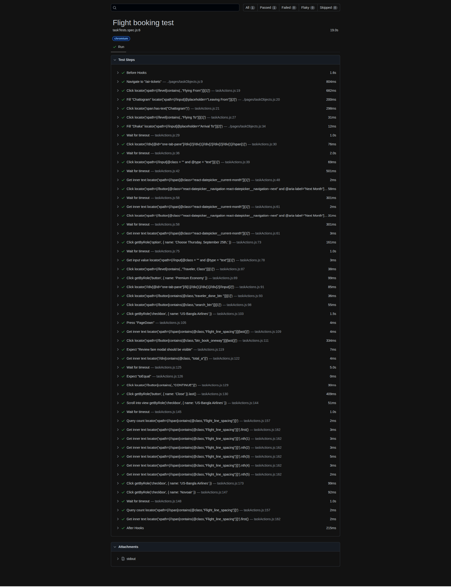

# QA Automation task for WSD.

This project covers an End-to-end(e2e) automation task for WSD. We have used a Playwright to automate all the scenarios. Please read below for installation and usage guidelines 

## Table of Contents

- [Project Title](#project-title)
  - [Table of Contents](#table-of-contents)
  - [Features](#features)
  - [Installation](#installation)
  - [Usage](#usage)
  - [Contact](#contact)

## Features
* Clean code principles followed
* Used Page Object Model to avoid redundant work and hard coding
* Single command run

## Installation
1. Clone the repo:
   ```sh
   https://github.com/Ekanto/wsd-assignment.git

2. Navigate to the project directory:
   ```sh
   cd wsd-assignment
   
3. Now run `npm install` to install the node dev dependencies. Also run `npx install playwright` to install playwright dependencies 

## Usage
In the project root directory - 
  
**Using the command line -**
- Type `npx playwright test`
- It will run all the tests in the command line
- You should be able to see the following information when all the tests are successfully passed

- It should generate a build-in HTML report. To generate, run -
  ```
  allure open ./allure-report
And it should be something like that

- Type `npx playwright test --headed` if you want to run the tests using browser / UI mode.
- Run `npx playwright show-report` to check the test status 


  


## Contact 

For any queries, reach me at - **umarekanto@gmail.com**


   


